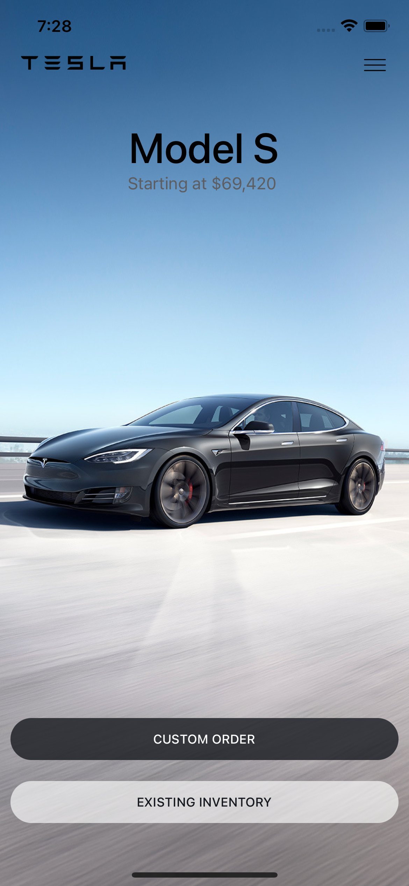
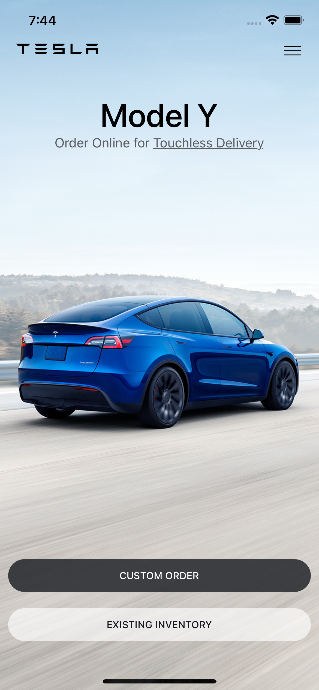

# Tesla Clone

This project is a clone of the Tesla app created using Expo. It aims to replicate some of the core features and user interface elements of the Tesla mobile application.

## Table of Contents

- Getting Started 
  - Prerequisites 
  - Installation
  - Running the App
- Features + Screenshot
- Built With

## Getting Started

### Prerequisites

Before you begin, ensure you have the following installed:

- [Node.js](https://nodejs.org/) - Make sure to use a version compatible with Expo.
- [Expo CLI](https://docs.expo.dev/get-started/installation/) - Install globally using `npm install -g expo-cli`.

### Installation

1. **Clone the repository:**

   ```bash
   git clone https://github.com/PeterQuiznose/TeslaClone.git


2. **Navigate to the project directory:**

    ```bash
    cd TeslaClone

3. **Install dependencies:**

    ```bash
    npm install

### Running the App
To start the Expo development server and run the app:

    ```bash
    npx expo start


Follow the Expo DevTools instructions to preview the app on an emulator or physical device.

## Features
- Simple list of available models of Tesla, made to look like the official Tesla App. Uses FlatList to allow the user to scroll through models. 





## Built With
- [React Native](https://reactnative.dev/) - A framework for building mobile applications using React.
- [Expo](https://expo.dev/) - A framework for building React Native applications with easy deployment and development tools.